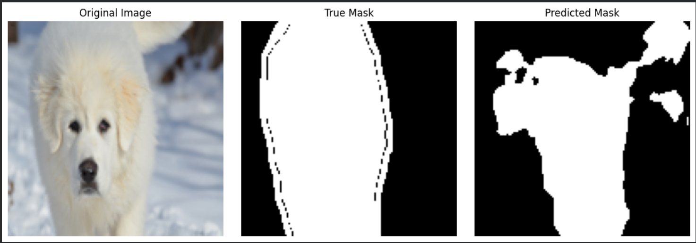

# 🐾 Pet Image Segmentation using U-Net

A deep learning project for **semantic segmentation of pet images** using the **U-Net architecture**. The model was built with TensorFlow/Keras and trained using the Oxford-IIIT Pet Dataset to identify pet regions at the pixel level.

## 📌 Project Overview

The goal of this project is to segment pets from image backgrounds by predicting a binary mask for each input image.

The complete pipeline includes:

- Dataset preprocessing
- Binary mask generation
- Train/Validation/Test splitting
- U-Net model implementation
- Model training
- Segmentation prediction
- IoU, Dice Score and Pixel Accuracy evaluation
- Prediction visualization

## 🧠 Model Architecture

The project uses a **U-Net convolutional neural network**, consisting of:

- Encoder with Conv2D and MaxPooling layers
- Bottleneck for high-level feature extraction
- Decoder with upsampling layers
- Skip connections between encoder and decoder
- Final segmentation output layer

**Total Parameters:** 1,946,881  
**Trainable Parameters:** 1,946,881

## 📊 Dataset

**Oxford-IIIT Pet Dataset**

Images and their trimap annotations were preprocessed into binary segmentation masks.

For the final experiment:

| Dataset | Samples |
|---|---:|
| Training | 2,399 |
| Validation | 300 |
| Test | 300 |

Input image size: **128 × 128 × 3**

Output mask size: **128 × 128 × 1**

## ⚙️ Training Configuration

| Parameter | Value |
|---|---|
| Optimizer | Adam |
| Loss Function | Binary Crossentropy |
| Batch Size | 16 |
| Epochs | 10 |
| Framework | TensorFlow / Keras |

## 📈 Test Results

| Metric | Result |
|---|---:|
| Mean IoU | 0.7006 |
| Dice Score | 0.8129 |
| Pixel Accuracy | 86.02% |

## 🖼️ Segmentation Output

The trained U-Net model predicts a binary segmentation mask for unseen pet images.

**Original Image → True Mask → Predicted Mask**



## 🛠️ Technologies Used

- Python
- TensorFlow / Keras
- NumPy
- Matplotlib
- Pillow
- scikit-learn
- Google Colab

## 🔄 Workflow

```text
Dataset
   ↓
Image & Mask Preprocessing
   ↓
Train / Validation / Test Split
   ↓
U-Net Model
   ↓
Model Training
   ↓
Prediction
   ↓
IoU + Dice Score + Pixel Accuracy
   ↓
Segmentation Visualization
```

## 🚀 Future Improvements

- Train using the complete dataset
- Apply data augmentation
- Train for more epochs
- Experiment with Dice loss or combined loss functions
- Improve segmentation around object boundaries

## 📁 Repository Contents

```text
pet-segmentation-unet/
│
├── CSE428_Pet_Segmentation_UNet.ipynb
├── README.md
└── Pet_Segmentation_UNet_Project_Documentation.docx
```

## 👩‍💻 Author

**Shahrin Tabassum**

Computer Science & Engineering  
Deep Learning / Computer Vision Project
